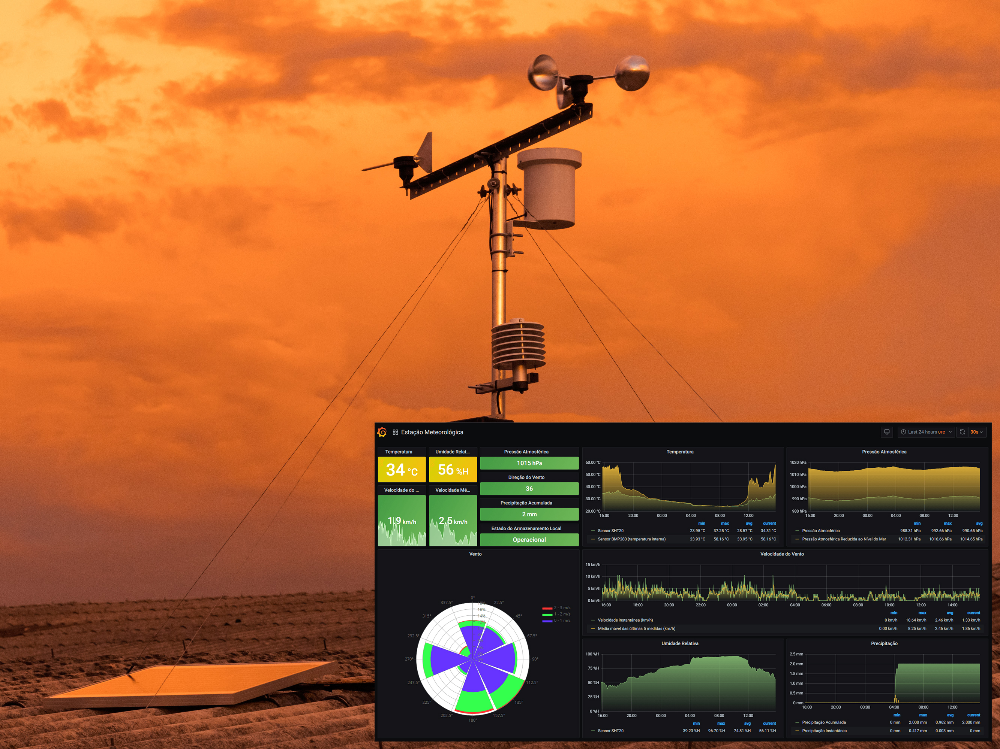
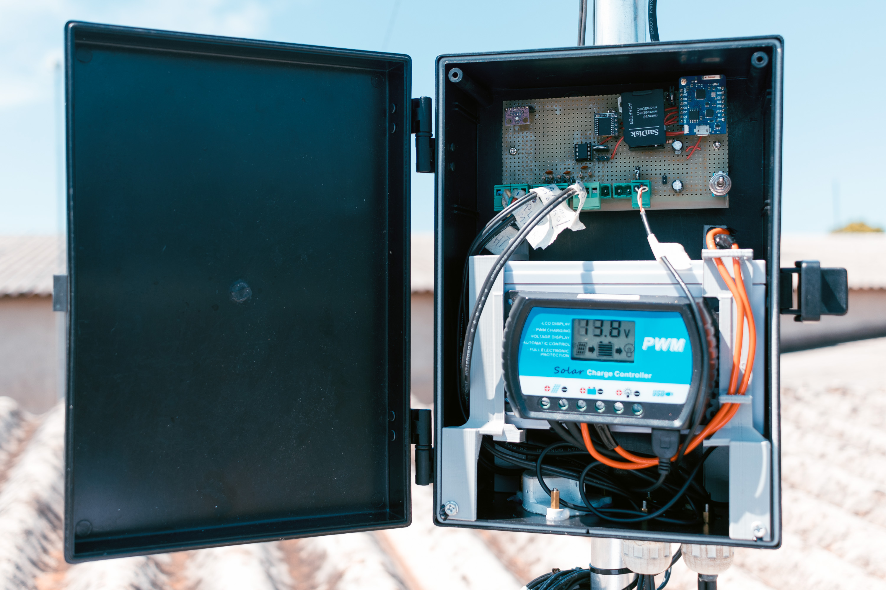
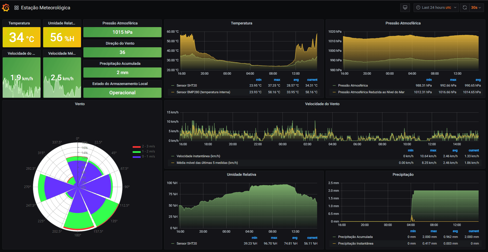

# PLATAFORMA DE DADOS METEOROLÓGICOS
Esse projeto tem por objetivo o desenvolvimento de uma plataforma de dados meteorológicos composta por estações meteorológicas, banco de dados e interface gráfica para análise e monitoramento. Espera-se com esse trabalho formar uma base de dados que permitirá a elaboração de estudos e previsão de geração de energia solar que podem ser aplicados para verificar a viabilidade de instalação de usinas solares, essa plataforma também poderá ser instalada junto de uma unidade geradora para auxiliar no monitoramento de geração, previsões e auxílio na tomada de decisões. Por se tratar de um projeto open source, almeja-se também contribuir com a redução de obstáculos e custos para disseminação e divulgação tecnológica desse tipo de tecnologia.

## ESTAÇÃO METEOROLÓGICA

Seguindo os conceitos de sensor autônomo e internet das coisas (IoT), foi projetada e construída uma estação meteorológica com microcontrolador ESP8266, programado em C/C++® no ambiente Arduino®, e inicialmente com os sensores de direção do vento, temperatura, umidade, pressão, pluviômetro e anemômetro, posteriormente serão implementados sensores de radiação solar direta e global, através de comunicação serial também é possível a implementação de sensores para monitorar a geração de energia, a estação processa os dados desses sensores, envia para internet através de conexão Wi-Fi® e também armazena localmente em cartão de memória.

Os esquemas elétricos para montagem da estação podem ser acessados no diretório *esquema-eletrico* e os códigos para os microcontroladores estão no diretório *software*, no projeto o circuito foi confeccionado usando uma placa ilhada, abaixo estão as tabelas com materiais necessários, esses sistemas foram integrados e montados na estrutura da estação, como pode ser visto nas imagens, os arquivos com as peças e montagem com o programa *Inventor* estão no diretório *estruturas*, também devem ser inseridos em breve os arquivos do projeto/desenhos técnicos em outros formatos.

Tabela 1: Lista de componentes eletrônicos e alojamentos da Estação Meteorológica.
Quantidade | Componente | Valor unitário (R$)
------------ | ------------- | -------------
1 | Bateria Estacionária 7Ah | 109,90
1 | Painel Solar Fotovoltaico 30W | 189,00
1 | Controlador de Carga RTD1230 30A 12/24V | 170,00
2 | Conector MC4 Painel Solar | 10,00
2 | Metro cabo 4 mm² | 5,00
1 | Metro fio 2,5 mm² flexível | 2,00
3 | Metro Cabo flexível 26 AWG | 0,37
1 | Caixa Plástica PB-255/2 | 79,90
1 | Pluviômetro | 344,61
1 | Indicador de direção do vento | 284,63
1 | Anemômetro | 263,970
1 | Sensor de temperatura e umidade SHT20 | 297,23
1 | Alojamento para sensor e temperatura e umidade | 250,74
1 | RTC DS3231 | 22,50
1 | Sensor de pressão e temperatura BMP280 | 14,90
4 | Diodo 1N4007 | 0,10
4 | Borne Conector F 2EDGK-5,0 - 2 Vias | 1,99
1 | Borne Conector F 2EDGK-5,0 - 4 Vias | 3,70
4 | Borne Conector M 2EDGVC-5,0 4P 180º | 1,75
1 | Wemos ESP8266 | 50,00
1 | ATtiny85 DIP8 | 17,00
1 | Soquete DIP8 | 3,00
1 | Mini chave HH Alavanca SMTS102 2 Posições | 2,70
1 | Barra de Pinos 40 vias 11,2mm 180 graus | 1,00
1 | Barra de soquete header fêmea 40 vias 180 graus | 1,65
1 | Cartão microSD com adaptador SD 8GB | 29,9
2 | Capacitor eletrolítico 470uF | 0,50
5 | Capacitor cerâmico 100nF | 0,10
1 | Resistor 220 Ohm 1/4W | 0,10
2 | Resistor 330 Ohm 1/4W | 0,10
2 | Resistor 1k Ohm 1/4W | 0,10
1 | Resistor 10k Ohm 1/4W | 0,10
1 | Resistor 47k Ohm 1/4W | 0,10
1 | Placa padrão tipo ilha 10x15 mm | 14,00
1 | Peças impressas em 3D | 50,00

Tabela 2: Lista de componentes da estrutura da estação meteorológica*.
Quantidade | Componente | Valor unitário (R$)
------------ | ------------- | -------------
1 | 2,5m Tubo redondo alumínio 1.1/4" X 1/16" (31,75mm X 1,58mm) | 39,00
1 | 3m Tubo quadrado alumínio 3/4 X 1/16 (1,9cm X 1,58mm) | 25,00
1 | Chapa de aço 2mmx80x60mm | 5,00
1 | Haste De Cobre Puro 10 mm X 500 mm | 50,00
1 | Borracha espessura 1x80x20mm | 5,00
3 | Espaçador m3 x 15mm | 0,30
7 | Parafuso m3 x 15mm | 0,12
7 | Parafuso m3 x 6mm | 0,10
1 | Parafuso m5 x 16mm | 0,20
2 | Barra roscada 1/4 x 100mm | 2,50
2 | Parafuso sextavado 1/4 x 16mm | 0,30
2 | Parafuso sextavado 1/4 x 30mm | 0,30
24 | Porca sextavada 1/4 | 0,10
20 | Ruela de metal m6 ou 1/4| 0,15
2 | Ruela de metal m3 | 0,10
4 | Ruela de borracha m6 ou 1/4 | 0,25
2 | Anel de borracha m6 | 0,15
6 | Abraçadeira U Vergalhão bitola 1 polegada 80mm rosca 1 quarto (Part. 0070.1) | 6,00
4 | Abraçadeira suporte (Part. 0070.2) | 4,10

***Observações**:
* Na lista e no projeto não estão inclusos estrutura para fixação do painel solar, essa pode ser construída ou comprada, variando de acordo com o tipo de instalação, como pode ser visto na imagem, aqui ela foi fixada em uma cantoneira metálica e essa foi parafusada sobre a cobertura da casa;
* Essa lista é uma base que bate com o projeto disponibilizado no diretório de *estruturas*, podendo/devendo ser alterado em função do local de instalação e conforme os sensores que serão implementados, como se pode notar ao comparar a estação do projeto e a que foi montada, como a que está construída está sobre uma casa onde não precisa de para-raios (já tem em outra estrutura nas proximidades), e também ainda não foram implementados sensores solares, então a estrutura ficou mais simples, para economizar, também podem construir utilizando sucatas;
* Como pode ser visto na imagem a seguir, à esquerda o número 1 indica haste adicionada ao projeto para instalação de sensores solares, na estação construída (à direita) não tem essa haste pois esses sensores ainda não ficaram prontos para serem implementados. Outro detalhe são o uso das barras roscadas que aparecem no projeto e na estação montada, elas servem para prender e regular os fios que fixam e mantem o posicionamento da estação.

## BANCO DE DADOS E INTERFACE GRÁFICA

O banco de dados e a interface de usuário foram implementados em um Raspberry Pi® utilizado como servidor, onde um algoritmo em Python® faz o recebimento e processamento dos dados que são colocados em banco InfluxDB®, nesse servidor foi implementada com Grafana® uma interface gráfica que é acessada por usuários através de um navegador web, sendo apresentados os parâmetros atualizados e séries temporais, como mostra a figura acima. No diretório *weather-station-server-side* é possível ver o script implementado e a documentação que apresenta como fazer a implementação dessa parte do projeto.

Tabela 3: Lista de Materiais para o Servidor.
Quantidade | Componente | Valor unitário (R$)
------------ | ------------- | -------------
1 | Raspberry Pi 4 Model B 4GB | 640,00
1 | Fonte para Raspberry Pi 4 | 65,00
1 | Cartão de memória classe 10 16GB | 60,00

## EQUIPE E CONTATO

Esse projeto foi desenvolvido por Romildo C Marques¹, aluno de engenharia física (UNILA), sendo orientado pelo prof. Oswaldo Hideo Ando Junior² (GPEnSE) da Universidade Federal da Integração Latino-Americana (UNILA).

Contato¹: romildo.marques@aluno.unila.edu.br
Contato²: oswaldo.junior@unila.edu.br

## APOIO E FOMENTO

Este projeto foi desenvolvido com apoio e fomento de:
* Conselho Nacional de Desenvolvimento Científico e Tecnológico - CNPq;
* Universidade Federal da Integração Latino-Americana (UNILA);
* Grupo de Pesquisa em Energia e Sustentabilidade Energética - GPEnSE;
* Programa Agenda Tríplice da UNILA pelo apoio e fomento à pesquisa.

## AGRADECIMENTOS
Aos amigos e familiares pelo apoio;
Ao professor Oswaldo Hideo Ando Junior pela orientação;
Ao professor Joylan Nunes Maciel por auxíliar com banco de dados;
Ao Lucas Teske (@racerxdl) que apresentou e recomendou as tecnologias InfluxDB e Grafana.

