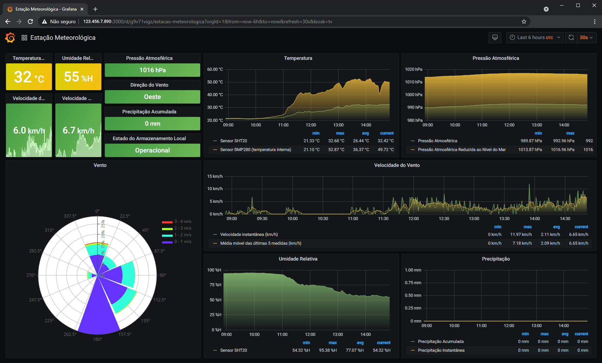
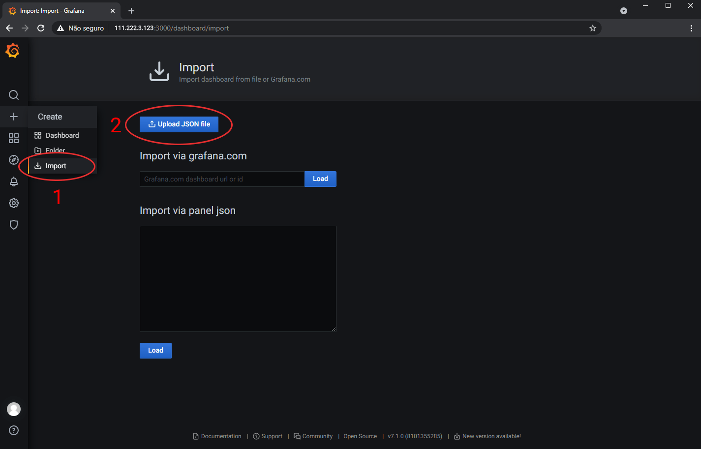
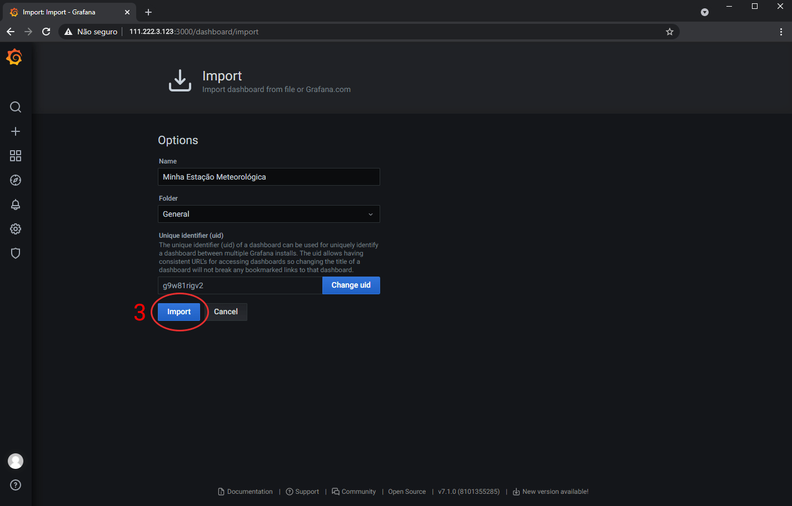

# Configuração Script, InfluxDB e Grafana
### Configuração Script e InfluxDB
Esse script em Python faz a conexão entre o servidor MQTT e o banco de dados, no topo do arquivo [script.py](./script.py) tem uma descrição de como isso é feito. Para o funcionamento desse código, é necessário instalar as bibliotecas utilizadas, que a estação meteorológica já esteja enviando dados para o servidor MQTT e que o banco de dados InfluxDB já esteja configurado com o nome **ws_test** (caso escolha outro nome, terá que mudar isso no script Python e no Grafana), antes de executar o script, adicione os parâmetros de conexão com MQTT e também InfluxDB, após isso, ao fazer uma simples execução, aparecerá na linha de comando um output do tipo:

```
MQTT-InfluxDB
Connected with result code 0
ws/esp b'20210317105749,24.64,98691.84,20.94,93.91,NE,1.33,30.50,1'
2021-03-17T10:57:49Z
Status: 
True
ws/esp b'20210317110048,27.41,98702.05,21.35,92.98,N,2.66,30.50,1'
2021-03-17T11:00:48Z
Status: 
True
```

Para um funcionamento mais estável, é preciso configurar o script para que seja iniciado automaticamente assim que o Raspberry Pi ou outro servidor seja ligado, a explicação de como fazer isso está na seção *Run MQTT InfluxDB Bridge Script at Startup of Subscriber*, da publicação [Visualize MQTT Data with InfluxDB and Grafana](https://diyi0t.com/visualize-mqtt-data-with-influxdb-and-grafana/), nesse mesmo texto também está a descrição de como implementar e configurar o Grafana, ferramenta que permite e visualização da dashboard. O script em Python disponibilizado no projeto da estação meteorológica é uma versão modificada do que é apresentado nesse texto.

## Configuração Grafana


Em [Visualize MQTT Data with InfluxDB and Grafana](https://diyi0t.com/visualize-mqtt-data-with-influxdb-and-grafana/), na seção 4 *Grafana Setup to Visualize Data from InfluxDB* tem o procedimento básico de instalação e configuração. Além das configurações básicas (usuários, conexão com banco de dados, etc) é preciso adicionar a dashboards, para ter uma igual a que é apresentada na imagem acima, instale o plugin [Windrose Panel for Grafana](https://github.com/fatcloud/windrose-panel) e em seguida acesse a interface do Grafana através do navegador, clique no ícone para adicionar uma dashboard e clique em importar (1), depois clique e **Upload JSON file** (2) e importe o arquivo **grafana.json** que está nesse diretório, para finalizar clique em **Import** (3), como apresentam as imagens abaixo.




Observação: Conforme comentado no primeiro paragrafo, caso tenha escolhido um nome diferente de **ws_test** para o banco de dados InfluxDB, será necessário alterar esse nome também no arquivo **grafana.json**, onde esse parâmetro é utilizado várias vezes.

Como está: ```"datasource": "InfluxDB-ws_test"```
Como deverá ficar caso escolha outro nome para a database: ```"datasource": "InfluxDB-MyDatabaseName"```

## MQTT

Nesse projeto foi utilizado o serviço de cloudmqtt.com, caso optar por não adquirir um serviço e queira fazer seu próprio servidor MQTT, é possível ver o passo a passo na seção *Setup the MQTT Broker to Receive MQTT Data (Raspberry Pi)*, da publicação [Send data from ESP8266 or ESP32 to Raspberry Pi via MQTT](https://diyi0t.com/microcontroller-to-raspberry-pi-wifi-mqtt-communication/).
