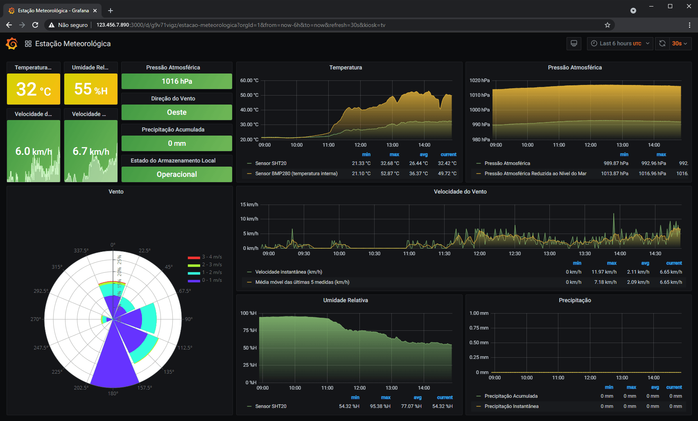

# Configuração Script, InfluxDB e Grafana

## Índice
- [Introdução](#introducao)
- [Configuração de reserva de endereço de IP via DHCP (servidor local)](#ip)
- [Instalação e configuração de banco de dados InfluxDB 1.8](#influx)
- [Instalação e configuração do Grafana](#grafana)
- [MQTT](#MQTT)

## Introdução

Essa parte da plataforma de dados meteorológicos deve ser implementada em servidor, que pode ser desde um Raspberry Pi (a partir da versão 3b) até um serviço VPS, sendo responsável pelas etapas que vão desde a recepção dos dados meteorológicos via MQTT até o armazenamento no banco de dados e disponibilização de interface gráfica ao usuário.

Para a implementação dessa etapa é interessante ter o conhecimento básico de redes, sistemas Unix/Linux, uso de terminal via SSH e linguagem Python, pois as implementações estão divididas em:

- Configuração de reserva de endereço de IP via DHCP (servidor local);
- Instalação e configuração de banco de dados InfluxDB 1.8;
- Configuração de parâmetros para o script Python e Crontab;
- Instalação e configuração do Grafana.

## Configuração de reserva de endereço de IP via DHCP (servidor local)

Ao completar a instalação do banco de dados, o mesmo deverá ser acessado através de um endereço de IP para armazenamento e requisições das informações meteorológicas, se estiver usando um Raspberry Pi em sua rede local, o seu modem pode dar endereços IP aleatórios ao Raspberry, para evitar isso é necessário que identifique o endereço MAC do seu Raspberry Pi, que pode estar na caixa dele ou então pode ser visto usando o comando *ifconfig* no terminal, o Raspberry Pi tem um endereço MAC para o Wi-Fi e outro para a conexão cabeada, então use o endereço MAC do tipo de conexão que estiver sendo utilizada. Com o endereço MAC, acesse a página de configuração de seu modem/roteador e vá até a opção de **DHCP Server** ou nome semelhante, nessa opção procure por **Address Reservation**, **Reserva de Endereço** ou nome semelhante, nessa opção você vai adicionar o endereço MAC do Raspberry Pi e reservar um endereço de IP para ele, reinicie o modem e o Raspberry para implementar a reserva de endereço, anote o IP escolhido, pois ele é um dos parâmetros necessários para o script em Python e também para o Grafana.

## Instalação e configuração de banco de dados InfluxDB 1.8

Esse projeto foi implementado com o banco de dados InfluxDB, para instalar esse banco de dados, acesse https://portal.influxdata.com/downloads/, instale também o influxdb-client com o comando *udo apt install influxdb-client*. Para saber mais sobre o uso do InfluxDB e uma base de como funciona a integração entre Python e InfluxDB, e também sobre a configuração do Grafana, veja a publicação disponível em https://diyi0t.com/visualize-mqtt-data-with-influxdb-and-grafana/, vale lembrar que a instalação do influxDB apresentada nesse segundo link não garante que será a versão 1.8 (necessária para ser compatível com o script python).

Nessa etapa, o nome padrão escolhido para o banco de dados foi **weather_stations_data**, também foi criado um usuário **putdata** para adicionar dados com o script em Python e o **getdata** que será utilizado pelo Grafana para solicitar dados. Caso escolha nomes diferentes, implemente as alterações nas próximas etapas, mudando isso no arquivo [**.env**](./.env) e no **Grafana**.

Para implementar atualizações, gerenciar o banco de dados, etc, verifique a documentação em [InfluxDB OSS 1.8 Documentation](https://docs.influxdata.com/influxdb/v1.8/).

## Configuração de parâmetros para o script Python e Crontab

O script em Python 3 é responsável por receber os dados via MQTT, processar eles e armazenar no banco de dados, para ele ser executado é necessário ter instaladas as bibliotecas que estão citadas nas primeiras linhas de [**script.py**](./script.py) e também ter no mesmo diretório o [**weather_station.py**](./weather_station.py) e o arquivo [**.env**](./.env) com parâmetros de configuração.

Em [**script.py**](./script.py) está o básico do programa, como receber os dados, fazer uma breve verificação e passar para as funções do [**weather_station.py**](./weather_station.py), que farão o resto do processamento e retornarão uma lista de dicionários, compatíveis com o tipo JSON, e esta é enviada para o banco de dados. As senhas, e o endereço de IP do banco de dados no Raspberry Pi/Servidor, credenciais do banco de dado e MQTT devem ser inseridas no arquivo [**.env**](./.env), esses trÊs arquivos estando na mesma pasta, já é possível executar para testes, durante a execução o programa retorna as saídas abaixo:

```
MQTT to InfluxDB script
Connected with result code 0
--------------------------------------------------------------------------------------------------------------------------------
Measurement time: 2021-08-04T14:43:08Z
Weather station: ws01
Message length: 11
Received data: 20210804144308,40.47,100230.45,21.88,44.03,E,2.66,0.00,snr,snr,1
Invalid serial_sensor1: snr => null
Invalid serial_sensor2: snr => null
Writing to database...
{'measurement': 'temperature_bmp', 'tags': {'location': 'ws01'}, 'time': '2021-08-04T14:43:08Z', 'fields': {'value': 40.47}}
{'measurement': 'pressure_bmp', 'tags': {'location': 'ws01'}, 'time': '2021-08-04T14:43:08Z', 'fields': {'value': 1002.3045}}
{'measurement': 'temperature_sht', 'tags': {'location': 'ws01'}, 'time': '2021-08-04T14:43:08Z', 'fields': {'value': 21.88}}
{'measurement': 'humidity_sht', 'tags': {'location': 'ws01'}, 'time': '2021-08-04T14:43:08Z', 'fields': {'value': 44.03}}
{'measurement': 'wind_direction', 'tags': {'location': 'ws01'}, 'time': '2021-08-04T14:43:08Z', 'fields': {'value': 90}}
{'measurement': 'anemometer', 'tags': {'location': 'ws01'}, 'time': '2021-08-04T14:43:08Z', 'fields': {'value': 2.66}}
{'measurement': 'pluviometer_raw', 'tags': {'location': 'ws01'}, 'time': '2021-08-04T14:43:08Z', 'fields': {'value': 0.0}}
{'measurement': 'sd_memory_status', 'tags': {'location': 'ws01'}, 'time': '2021-08-04T14:43:08Z', 'fields': {'value': 1}}
Status write data to Influx Database: True
--------------------------------------------------------------------------------------------------------------------------------
Measurement time: 2021-08-04T14:43:15Z
Weather station: ws_test
Message length: 11
Received data: 20210804144315,36.58,100283.08,31.86,31.66,SE,2.66,1.75,snr,snr,1
Invalid serial_sensor1: snr => null
Invalid serial_sensor2: snr => null
Writing to database...
{'measurement': 'temperature_bmp', 'tags': {'location': 'ws_test'}, 'time': '2021-08-04T14:43:15Z', 'fields': {'value': 36.58}}
{'measurement': 'pressure_bmp', 'tags': {'location': 'ws_test'}, 'time': '2021-08-04T14:43:15Z', 'fields': {'value': 1002.8308}}
{'measurement': 'temperature_sht', 'tags': {'location': 'ws_test'}, 'time': '2021-08-04T14:43:15Z', 'fields': {'value': 31.86}}
{'measurement': 'humidity_sht', 'tags': {'location': 'ws_test'}, 'time': '2021-08-04T14:43:15Z', 'fields': {'value': 31.66}}
{'measurement': 'wind_direction', 'tags': {'location': 'ws_test'}, 'time': '2021-08-04T14:43:15Z', 'fields': {'value': 135}}
{'measurement': 'anemometer', 'tags': {'location': 'ws_test'}, 'time': '2021-08-04T14:43:15Z', 'fields': {'value': 2.66}}
{'measurement': 'pluviometer_raw', 'tags': {'location': 'ws_test'}, 'time': '2021-08-04T14:43:15Z', 'fields': {'value': 1.75}}
{'measurement': 'sd_memory_status', 'tags': {'location': 'ws_test'}, 'time': '2021-08-04T14:43:15Z', 'fields': {'value': 1}}
Status write data to Influx Database: True

```

Perceba as linhas alertando para valores inválidos 'Invalid serial_sensor1: snr => null', isso é porque o código está preparado para receber valores de sensores solares que atualmente não estão conectados nas estações, estes serão os serial_sensor1 e serial_sensor2 que por estarem desconectados a estação manda apenas um código 'snr' (serial not received), que o script em python identifica e então não armazena os valores.

Para que esse script seja iniciado automaticamente após o Raspberry Pi o servidor ser reiniciado ou sofrer alguma interrupção, é necessário configurar o [Crontab](https://www.raspberrypi.org/blog/how-to-run-a-script-at-start-up-on-a-raspberry-pi-using-crontab/), para isso siga os comandos abaixo no terminal/SSH do Raspberry Pi, caso for servidor os comandos ou diretórios serão diferentes.

```
cd /home/pi
mkdir weather-station-server-side
cd weather-station-server-side
mkdir logs
nano launcher.sh
```
Após o último comando abrirá o editor nano, cole nele o conteúdo do arquivo **launcher.sh** e feche com ctrl + x. Em seguida tecle o comando `sudo crontab -e`, abrirá um arquivo, após as linhas de instruções adicione a instrução a seguir e tecle ctrl + x: `@reboot sh /home/pi/weather-station-server-side/launcher.sh >/home/pi/weather-station-server-side/logs/cronlog 2>&1`


Após executar essas configurações, reinicie o Raspberry Pi, na pasta logs terá um arquivo onde ficarão os logs do script. No artigo [Visualize MQTT Data with InfluxDB and Grafana](https://diyi0t.com/visualize-mqtt-data-with-influxdb-and-grafana/) o autor também apresenta sobre o crontab. 

## Instalação e configuração do Grafana


Em [Visualize MQTT Data with InfluxDB and Grafana](https://diyi0t.com/visualize-mqtt-data-with-influxdb-and-grafana/), na seção 4 *Grafana Setup to Visualize Data from InfluxDB* tem o procedimento básico de instalação e configuração. Além das configurações básicas (usuários, conexão com banco de dados, etc) é preciso adicionar a dashboards, para ter uma igual a que é apresentada na imagem acima, instale o plugin [Windrose Panel for Grafana](https://github.com/fatcloud/windrose-panel) e em seguida acesse a interface do Grafana através do navegador, clique no ícone para adicionar uma dashboard e clique em importar (1), depois clique e **Upload JSON file** (2) e importe o arquivo [**grafana-dashboard-model.json**](./grafana-dashboard-model.json) que está nesse diretório, para finalizar clique em **Import** (3), como apresentam as imagens abaixo.


Observação: a base/banco de dados **weather_stations_data** deverá ser configurada como padrão/default no grafana.

## MQTT

Nesse projeto foi utilizado o serviço de cloudmqtt.com, caso optar por não adquirir um serviço e queira fazer seu próprio servidor MQTT, é possível ver o passo a passo na seção *Setup the MQTT Broker to Receive MQTT Data (Raspberry Pi)*, da publicação [Send data from ESP8266 or ESP32 to Raspberry Pi via MQTT](https://diyi0t.com/microcontroller-to-raspberry-pi-wifi-mqtt-communication/).
