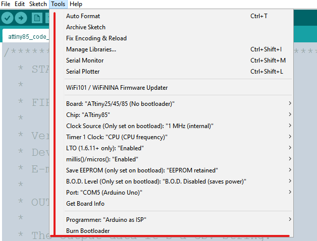
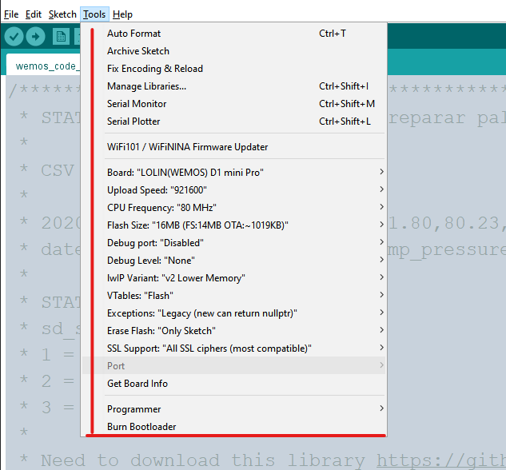

# ATtiny85

Para a gravação de código no ATtiny85 é necessário remover ele da placa da estação meteorológica e usar um Arduino como placa gravadora, além disso é necessário configurar a IDE Arduino instalando a placa e selecionando as opções corretas antes de enviar o código, abaixo estão as configurações utilizadas e em seguida alguns links de referência.

Configuração da IDE Arduino para compilação e envio de código para ATtiny85

[Como Gravar um Attiny85 usando um Arduino Nano](https://youtu.be/0S3D9iLHu5w)
[Programar o ATtiny85 com Arduino: como funciona](https://br-arduino.org/2015/01/programar-o-attiny85-com-arduino-como-funciona.html)
[Como gravar o bootloader do ATtiny85 com Arduino](https://www.arduinoecia.com.br/gravar-bootloader-attiny85-arduino-uno/)

# ESP8266

O ESP8266, usado na estação meteorológica como placa de desenvolvimento WEMOS, para ser programado com IDE Arduino é necessário configurar a IDE instalando a placa e selecionando as opções corretas antes de enviar o código, abaixo estão as configurações utilizadas e em seguida alguns links de referência.

Configuração da IDE Arduino para compilação e envio de código para ESP8266 (WEMOS Dev Board)

[Configurar Arduino IDE com ESP8266 e Blynk (HomeLab)](https://edisciplinas.usp.br/pluginfile.php/6231574/mod_resource/content/3/Configurar%20Arduino%20IDE%20com%20ESP8266%20e%20Blynk%20%28HomeLab%29.pdf)
[Conheça o Wemos D1 Mini: pequena no tamanho e imensa nas funcionalidades](https://blogmasterwalkershop.com.br/embarcados/wemos/conheca-wemos-d1-mini)

# Diretórios

Na pasta de hardware tem os projetos em 3D e peças da estação meteorológica, e também projeto de placa controladora e esquema/circuito elétrico, na pasta de software estão os códigos que estão gravados nos microcontroladores das estações meteorológicas. Na pasta attiny85-solar tem um código base para rodas nos microcontroladores dos sensores solares, esse código foi testado com o ATtiny85 conectado na estação e enviando dois números inteiros aleatórios (simulando leitura analógica) para a estação, que recebia esses parâmetros e envia para o servidor.